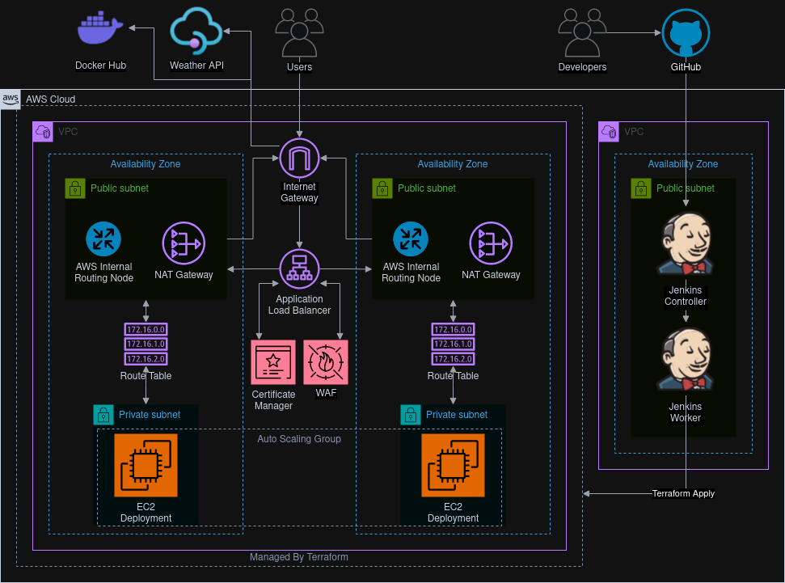

# Secure Webapp pipeline
The project was created as a home assigment.  
Required properties:
* Secure cloud deployment
* IaC using Terraform
* Version Control
* Pipeline with vulnerability scanning

## Tools used:
* **GitHub** - Git Repository
* **Terraform** - Infrastructure as code
* **Jenkins** - CI/CD
* **Docker** - For creating images and running containers on deployment
* **SonarCube** - Static code analysis
* **Snyk** - Dependencies and image vulnarability scan

## Infrastructure
Terraform is used for managing the infrastructure using modules.  
Backend used, saving state in S3 and lock in DynamoDB.  
Using availability zones input variable you can select in which AZs the infrastructure will be created.  
[Deployment README](terraform/deployment/README.md)
#### Network: [README](terraform/modules/network/README.md)
* VPC
* Private and public subnets for specified availability zones
* Internet Gateway
* NAT Gateways one per availability zone for resilience
#### Security:
* AWS WAF [README](terraform/modules/waf/README.md)
* TLS Certificate using AWS Certificate Manager [README](terraform/modules/acm-certificate/README.md)
* Security Groups and NACL
#### Load Balancing: [README](terraform/modules/alb/README.md)
* Application Load Balancer 
#### Compute: [README](terraform/modules/compute/README.md)
* EC2 Auto Scaling Group

## Pipeline
The pipeline consists of the following steps:
1. Static Code Analysis using SonarCube
2. Build Docker Image
3. Scan Dependencies and Image using Snyk
4. Image unit tested
5. Image pushed and signed using Docker Trust
6. Running Terraform to manage infrastructure and refresh instances

## Infrastructure Diagram
